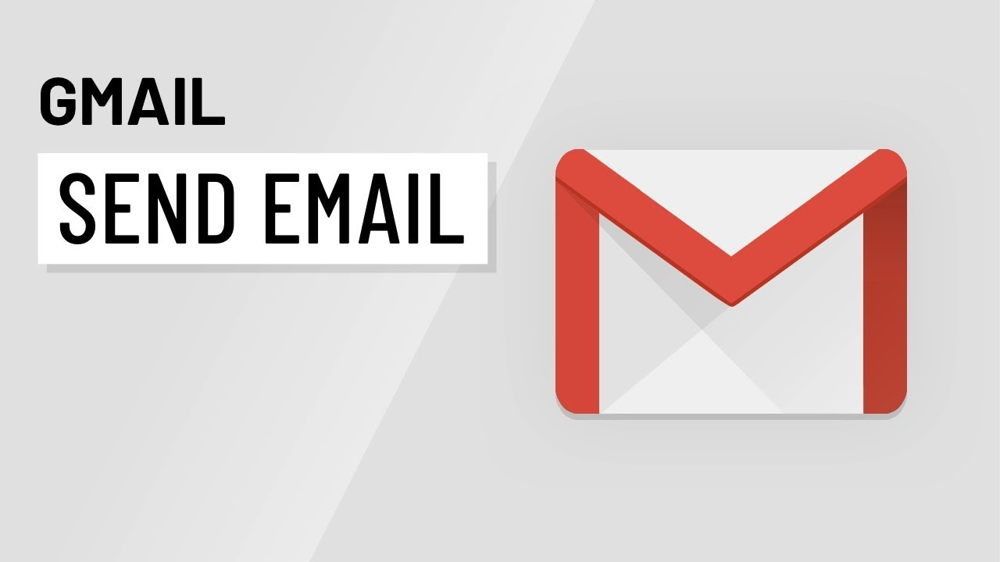

# Description 
- This automated program allows the user to send the same email to however many other people they want in seconds!

# Instructions 
- If you do not have python installed, you can simply download the [Installer](https://github.com/JordanLeich/Email-Sending-Automation/blob/master/Email%20Automation%20Installer.exe) and then open the main.exe file inside the folder!

# Warning
1. You will need a Gmail account to be able to send emails to others.
1. You also need the password to the sending Gmail account to be able to log in.
1. Please do not use this automation tool to spam others!

